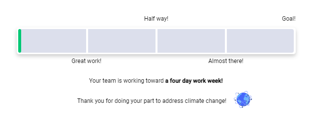
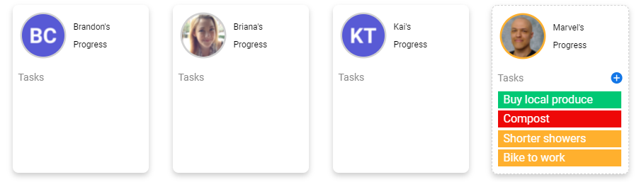
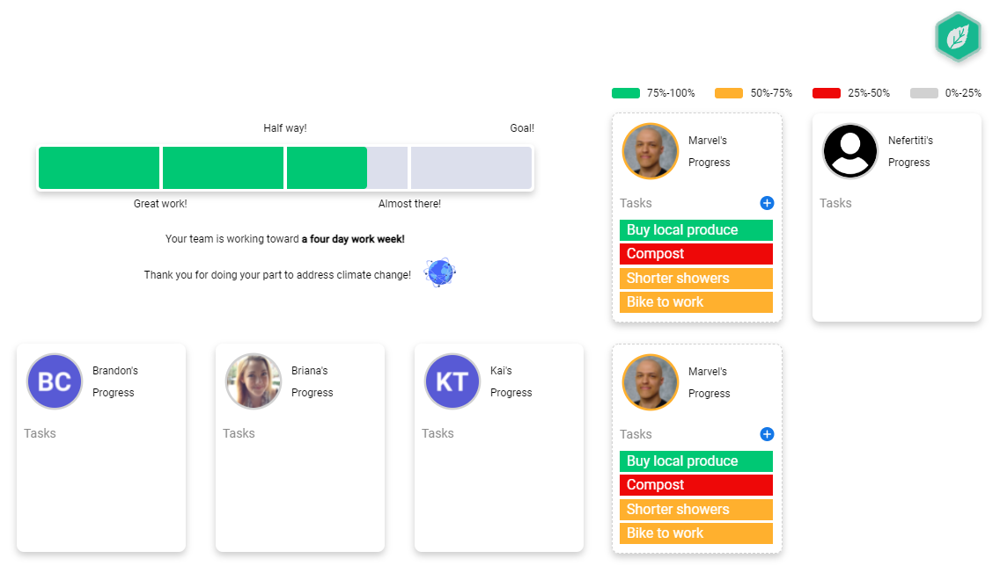
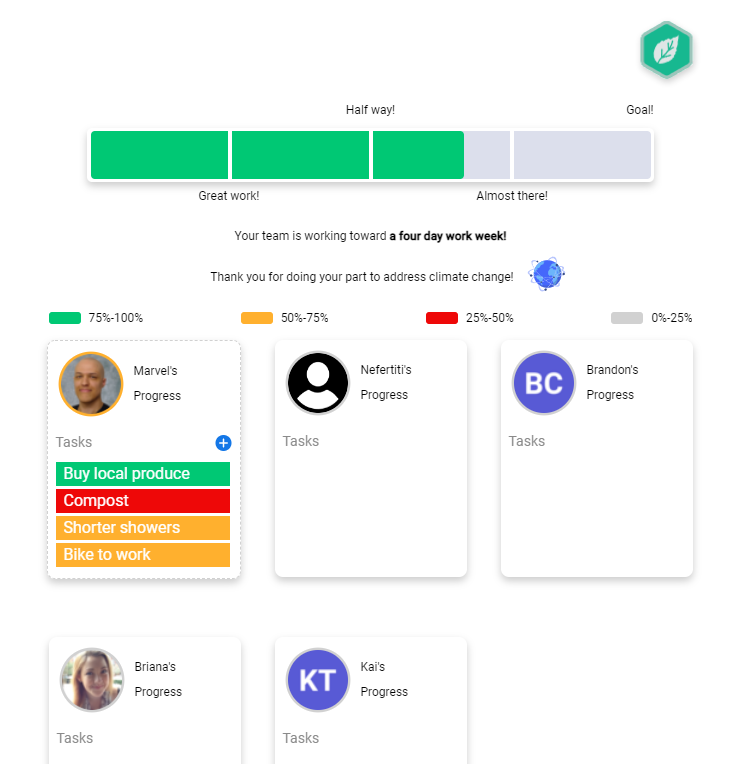

# Green-Works

## Description

Green Works is an app built for [Monday](https://www.monday.com), during a hackathon. It's purpose is to track sustainable practices while incentivizing engagement in the digital workplace.

 
 

## Project Dependencies

- [React](https://reactjs.org/) for the frontend
- The [Monday Vibe Design System](https://style.monday.com/) for styling guidlines and components
- The [Monday GraphQL API](https://developer.monday.com/api-reference/docs) for querying user data
- The [Monday Apps framework SDK](https://github.com/mondaycom/monday-sdk-js#mondaycom-apps-framework-sdk-for-javascript) for seamless authentication and app storage

 
 

## Overview

Users visit [Monday.com](https://www.monday.com), navigate to a workspace, and create a new board (installing Green Works from the [app marketplace](https://monday.com/marketplace)). Teams may then configure a monthly point goal, setup tasks, collaborate, and more.

 
 

## Features

A sleek way to track your team's progress towards monthly goals.

Individual users can choose whatever tasks they'd like, each of which will contribute to the teams total point goal.

The app is designed to fit comfortably within the workspace, and dynamically adjusts to your screen size.

Responsive Design Example 1

Responsive Design Example 2

 
 

## Credits

- Briana Van Slyck | [LinkedIn](https://www.linkedin.com/in/brianavanslyck/)
- Brandon Cespedes | [LinkedIn](https://www.linkedin.com/in/brandon-cespedes/)
- Nefertiti Bourne | [LinkedIn](https://www.linkedin.com/in/nefertitibourne/)
- Kai Tsehay | [LinkedIn]()
- Marvel Johnson | [LinkedIn](https://www.linkedin.com/in/marvel-johnson/)
